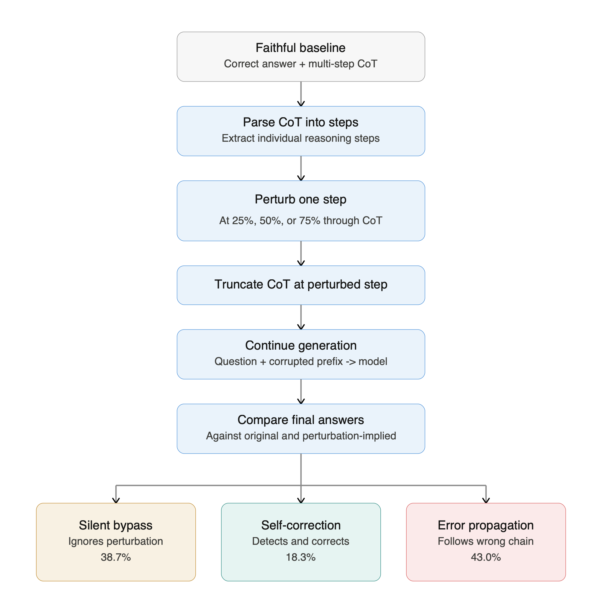

# From Decorative to Load-Bearing: Task Difficulty Shapes the Causal Role of Chain-of-Thought

**Renee Jia** (R2M AI, Cornell University) · **Di Mu** (R2M AI, Carnegie Mellon University)
Transactions on Machine Learning Research (TMLR), 2026 · [OpenReview](https://openreview.net/forum?id=TiZQnKDIHq) · [Camera-ready PDF](paper/main.pdf)

When a language model writes a chain of thought (CoT), does the written reasoning actually constrain the answer? We test this with a **perturb-and-continue** protocol: generate a correct CoT, replace one intermediate step with a wrong one, truncate, and force the model to continue. Each continuation is classified as **silent bypass** (Type A: the model ignores the wrong step and still answers correctly), **self-correction** (Type B: it notices and fixes the error), or **error propagation** (Type C: it follows the wrong step to a wrong answer).

The main finding is a **difficulty gradient**: CoT is decorative on easy tasks and load-bearing on hard ones. On Gemma-2-9B-IT, error propagation rises from 3.9% on GSM8K to 22.3% on MMLU and 40.9% on BIG-Bench Hard; holding perturbation type fixed, it rises 16× from GSM8K to BBH multistep arithmetic; and a variance partition on 28,584 continuations attributes 98.8% of explained deviance to task difficulty against 0.8% to perturbation type. The gradient replicates on Llama-3.1-8B-Instruct, is compressed on DeepSeek-R1-Distill-Qwen-7B, is readable from hidden states with linear/MLP probes, and is not reliably controllable by additive activation steering.

<p align="center"></p>

---

## Contents

| Path | What it is |
|---|---|
| `paper/` | Camera-ready LaTeX source, bibliography, TMLR style files, and the compiled PDF |
| `scripts/` | The main pipeline (Gemma-2-9B-IT): data download → CoT generation → perturbation + continuation → rule + LLM-judge classification → probes → activation steering → Llama replication |
| `scripts/v8/`, `scripts/v9/` | Analysis add-ons (judge prompt sensitivity, binary C-vs-non-C replication, perturbation uptake) and the BBH answer-format label fix |
| `revision/scripts/` | Experiments added during review: matched 2×2 of perturbation type × difficulty, perturbation-strength sweep, variance partition, four-variant judge re-run, DeepSeek-R1-Distill and base-Gemma cross-model runs, multi-direction steering, probe-vs-human comparison |
| `revision/revision_exp_results/` | Small result files (JSON/CSV summaries) from those experiments; large intermediate files are regenerated by the scripts |
| `revision/human_annotation/`, `revision/human_annotation_n500/` | Human-validation studies: annotator instructions, the blinded labeling files as sent to annotators, the sampler, and the agreement / Cohen's κ analysis scripts |
| `figures/` | All figures and CSV tables used in the paper (`paper/figures` is a symlink to this directory) |
| `data/` | Small artifacts only: BBH task mapping, judge validation set, Llama summary, and 50-example samples of the labeled continuation format. Raw datasets and all large derived files are regenerated by the pipeline (see [Data](#data)) |
| `results/` | Analysis outputs consumed by the plotting scripts |

The directory layout is identical to the repository the experiments were run in, so every script's relative path works when run from the repository root.

---

## Setup

**Hardware.** All model inference was run on a single NVIDIA H100 80 GB. A 40 GB GPU works with smaller batch sizes (`--batch-size`, `--gpu-memory-utilization`). The judge stage and all analysis/plotting scripts run on CPU.

**Software.** Python 3.10+, CUDA 12.x.

```bash
git clone https://github.com/renee-jia/load-bearing-cot.git
cd load-bearing-cot
pip install -r requirements.txt
```

**Model access.** Gemma-2-9B-IT and Llama-3.1-8B-Instruct are gated on Hugging Face; accept the licenses and run `huggingface-cli login` once. DeepSeek-R1-Distill-Qwen-7B is ungated.

**LLM judge.** Borderline A/B cases are classified by Claude (`claude-haiku-4-5-20251001` in production, `claude-sonnet-4-20250514` for validation). The judge scripts take the key as `--api-key <key>` (or `--api-key "$ANTHROPIC_API_KEY"`). This is the only external API call in the pipeline; everything else runs locally.

---

## Reproducing the main pipeline (Gemma-2-9B-IT)

Run from the repository root. Times are single-H100 estimates.

| Step | Command | Purpose | ≈ time |
|---|---|---|---|
| 0 | `python scripts/0_download_datasets.py` | Download GSM8K and MMLU to `data/raw/` | 1 min |
| 1 | `python scripts/1_generate_cot.py` | Zero-shot CoT with Gemma-2-9B-IT (vLLM); keeps correct, ≥3-step baselines | 20 min |
| 1b | `python scripts/11_bbh_pipeline.py --step all` | Same for BIG-Bench Hard (download + CoT) | 15 min |
| 2 | `python scripts/2_create_perturbations.py` | Perturb one step (7 strategies × 3 positions), truncate, force-continue; writes `data/processed/expanded_pairs.json` | 45 min |
| 2b | `python scripts/2b_subclassify.py` | Rule-based A/B/C labels; ambiguous rows are marked `NEEDS_JUDGE` | 1 min |
| 3 | `python scripts/9a_validate_judge.py --api-key $KEY` then `python scripts/9b_run_judge.py --api-key $KEY` | Validate the LLM judge on known cases, then label every `NEEDS_JUDGE` row | 3 min |
| 3b | `python scripts/v9/fix_bbh_labels.py` then `python scripts/v9/propagate_labels.py` | BBH answer-format fix (see below) and propagation of corrected labels to downstream files | 5 min |
| 4 | `python scripts/10_mlp_layer_sweep.py` | Extract hidden states at three token positions across all 42 layers and train linear + MLP probes (3-class, bypass, error-propagation) with grouped 5-fold CV | 25 min |
| 4b | `python scripts/10b_retrain_probes.py`, `python scripts/compute_auroc.py` | Re-fit probes from saved features (no GPU) and compute AUROCs | 2 min |
| 5 | `python scripts/12_causal_intervention.py` | Single-direction activation steering at layer 21 with dose–response, layer, cross-dataset and random-direction controls (11,556 generations) | 50 min |
| 6 | `python scripts/13_prompt_steering.py` | Prompt-stage steering control | 10 min |
| 7 | `python scripts/7_behavioral_analysis.py`, `python scripts/8_leakage_test.py` | Position gradient, strategy breakdown, feature-leakage check | 2 min |
| 8 | `python scripts/14_llama_crossmodel.py` | Full pipeline on Llama-3.1-8B-Instruct | 105 min |

`scripts/run_all.sh` chains steps 0–7 inside a `tmux` session and logs to `logs/`. (Several scripts still print the project's original working name, `cot-lies`; the logic is unchanged.)

**The BBH label fix (step 3b).** The original answer check compared BBH answers against an empty `correct_letter` field, which mislabeled 3,229 correct BBH continuations as Type C. `scripts/v9/fix_bbh_labels.py` re-scores them and sends the ambiguous rows to the judge; all numbers in the paper are post-fix.

**Classification prompts.** The rule is in `scripts/2b_subclassify.py`; the production judge prompt and its validation prompt are in `scripts/9b_run_judge.py` / `scripts/9a_validate_judge.py`; the four prompt variants used in the sensitivity analysis are in `revision/scripts/exp_2_0_judge_persistence.py`. All prompts are also printed in the paper's appendix.

---

## Revision experiments

These were added during review and are reported in §4.2–§5 and the appendices. Each script is self-contained; `--stage` selects the generate / judge / analyze phase where applicable.

| Script | Paper | What it does |
|---|---|---|
| `exp_1_1_confound_gsm8k_text.py` | §4.2, Table 2 | Text-based perturbations on GSM8K (off-diagonal cell of the type × difficulty 2×2) |
| `exp_1_3_confound_numerical.py` | §4.2, Table 2 | Numerical perturbations on BBH multistep arithmetic and other hard tasks (the other off-diagonal cell) |
| `exp_1_4_strength_axis.py` | §4.2, App. | Perturbation-magnitude sweep (n+1, n×2, n×2+3) |
| `exp_1_5_llama_replication.py` | §5, App. | Llama replication of the two new arms |
| `exp_1_5_variance_decomp.py` | §4.2, App. | Logistic GLM and sequential deviance partition on the combined n = 28,584 frame (reads the outputs of the runs above) |
| `exp_2_0_judge_persistence.py` | §3.3, Fig. 3 | Re-judge every non-C continuation under four prompt variants; per-row results in `revision_exp_results/exp_2_0_judge/stratification.json` |
| `exp_2_3_extract_annot_features.py`, `exp_2_3_probe_vs_human.py` | App. | Probe-vs-human agreement on the n = 200 pilot rows |
| `exp_3_1_deepseek_crossmodel.py`, `exp_3_1_judge_deepseek.py`, `exp_3_1b_deepseek_prompts.py` | §5, App. | DeepSeek-R1-Distill-Qwen-7B run (`</think>` parsing, ≥4 post-think steps) and prompt diagnostics |
| `exp_3_2_base_gemma_crossmodel.py`, `exp_3_2b_base_gemma_fewshot.py` | App. | Base Gemma-2-9B viability gate, zero- and few-shot |
| `exp_4_2_multidir_steering.py`, `exp_4_2_make_figure.py` | §4.4, Fig. 5 | k-direction steering (k ∈ {2,4,8}) on two basis constructions |
| `make_supplemental_figures.py`, `make_human_agreement_n500.py` | App. | Variance-partition and human-agreement figures |
| `audit_all_numbers.py` | — | Cross-checks every number in `paper/main.tex` against the result files |

Plotting scripts for the main-text figures are `scripts/plot_unified_scatter.py`, `scripts/plot_accuracy_vs_errorprop.py`, `scripts/plot_judge_sensitivity_full.py`, `scripts/plot_deepseek_layer_sweep.py`, and `scripts/v8/plot_judge_sensitivity.py`.

---

## Human validation

Two blind human-annotation studies validate the behavioral labels (paper §3.3 and Appendix "Human Annotation Protocol").

| | n = 200 pilot | n = 500 study |
|---|---|---|
| Annotators | 1 | 2, independent |
| Files | `revision/human_annotation/` | `revision/human_annotation_n500/` |
| Instructions given to annotators | `INSTRUCTIONS.md` (EN), `INSTRUCTIONS_zh.md` (ZH) | `for_annotators/annotator{1,2}/INSTRUCTIONS*.md` |
| Blinded labeling file (as sent, unlabeled) | `data_to_label.csv` | `for_annotators/annotator{1,2}/data_to_label_annotator{1,2}.csv` |
| Hidden metadata (stratum, rule / judge labels; never shown to annotators) | `_analysis_metadata.csv` | `analysis/_analysis_metadata.csv`, `analysis/sample_manifest.json` |
| Sampler / analysis | `analyze_when_done.py` | `analysis/build_sample_n500.py`, `analysis/analyze_when_done_n500.py` |
| Aggregate results | `results_n200.json` | `analysis/results_n500.json` |

The labeling files are released exactly as they were sent to the annotators (labels blank), together with the hidden metadata and the analysis scripts that join the two. The annotators' returned label files are not part of this repository; the aggregate numbers they produced are in the `results_*.json` files and in the paper. Given a returned file, the analysis is

```bash
python revision/human_annotation_n500/analysis/analyze_when_done_n500.py \
    --annotator1 <returned annotator1 csv> --annotator2 <returned annotator2 csv>
```

Headline: inter-annotator κ = 0.93 on the four-way label and κ = 1.00 on the C-vs-non-C split; the human consensus agrees with the paper's labels on 96.2% of rows for C-vs-non-C and 76.0% for the full three-way label. `analysis/build_sample_n500.py` is the deterministic sampler (seed 20260829); it needs the regenerated `data/processed/expanded_pairs.json`.

---

## Data

Everything the paper reports can be regenerated from public sources with the scripts above; the source datasets (GSM8K, MMLU, BIG-Bench Hard) are downloaded automatically.

Included in this repository (small):

- `data/samples/gemma_sample_50.json`, `data/samples/llama_sample_50.json` — 50 labeled continuations each, showing the exact record format produced by step 2 (`prompt`, `original_step`, `perturbed_step`, `continuation`, `strategy`, `perturbation_point`, rule and judge labels).
- `data/processed/judge_validation.json` — the hand-labeled cases used to validate the judge.
- `data/processed/bbh_task_mapping.json`, `data/processed/llama_results_summary.json`.
- `revision/revision_exp_results/**` — JSON/CSV summaries of the revision experiments, including the per-row four-variant judge labels.
- Both human-annotation studies: instructions, blinded labeling files, hidden metadata, scripts, and aggregate results (the annotators' returned label files are not included).

Not included (too large for git; regenerated by the pipeline): the ~21k labeled continuations (`data/processed/expanded_pairs.json`, ~100 MB), hidden-state feature arrays, probe checkpoints, steering generations, and the per-model raw CoT files. Contact the authors if you need the exact files used for the paper.

---

## Paper

```bash
cd paper
tectonic main.tex        # or: latexmk -pdf main.tex
```

`paper/figures` is a symlink to `../figures`; on systems without symlink support, copy `figures/` into `paper/`.

---

## Key numbers (Gemma-2-9B-IT unless noted)

| | GSM8K | MMLU | BBH |
|---|---|---|---|
| Base accuracy | 86.5% | 74.8% | 57.9% |
| Silent bypass (A) | 94.5% | 41.5% | 37.4% |
| Self-correction (B) | 1.6% | 36.3% | 21.7% |
| Error propagation (C) | 3.9% | 22.3% | 40.9% |

A/B rates are under the production judge prompt and are prompt-sensitive; the C column is prompt-invariant and is the dimension the paper's claims rest on.

- Type × difficulty: 98.8% of explained deviance to difficulty, 0.8% to perturbation type (n = 28,584).
- Probes (grouped 5-fold CV, N = 2,000): bypass 79.4% at layer 10 (linear, AUROC 0.85); 3-class 75.3% at layer 23 (MLP); error propagation 86.2% at layer 28 (MLP).
- Steering: single-direction additive steering flips no behavioral type across 11,556 generations; an 8-direction probe basis flips 24.6% of Type C at the strongest setting.
- Cross-model: Llama-3.1-8B-Instruct reproduces the gradient (57.2% error propagation overall at 41.6% accuracy); DeepSeek-R1-Distill-Qwen-7B suppresses propagation broadly and compresses it.

---

## Citation

```bibtex
@article{jia2026loadbearing,
  title   = {From Decorative to Load-Bearing: Task Difficulty Shapes the Causal Role of Chain-of-Thought},
  author  = {Jia, Renee and Mu, Di},
  journal = {Transactions on Machine Learning Research},
  year    = {2026},
  url     = {https://openreview.net/forum?id=TiZQnKDIHq}
}
```

## License

Code is released under the MIT License (see `LICENSE`). The paper text and figures are © the authors.

## Contact

Renee Jia — reneejia@r2m.ai
