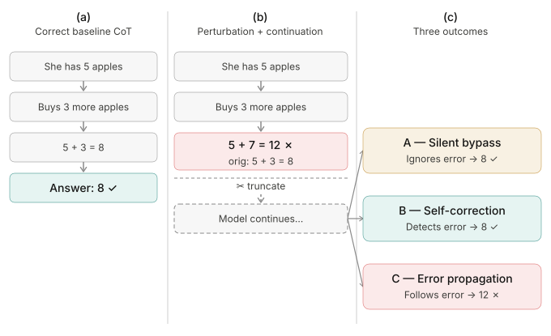

# From Decorative to Load-Bearing

### Task Difficulty Shapes the Causal Role of Chain-of-Thought

**Renee Jia**, **Di Mu** · [R2M AI](https://r2m.ai/) · *Transactions on Machine Learning Research*, 2026

[**Paper**](https://openreview.net/forum?id=TiZQnKDIHq) · [PDF](https://openreview.net/pdf?id=TiZQnKDIHq) · [Dataset](https://huggingface.co/datasets/ReneeJia/cot-load-bearingness) · [Protocol spec](docs/protocol.md) · [Reproduction guide](docs/paper-reproduction.md) · [Experiment map](experiments/README.md)

---

A chain of thought is a piece of text a model writes before it answers. Whether that text *does* anything is an empirical question — and it is precisely the question that chain-of-thought monitoring rests on. A monitor that reads the chain is informative only if the chain constrains the answer.

We test the link directly. **Change one step mid-chain, truncate the trace there, and force the model to continue.** What it writes next reveals whether it ignores the injected error, notices and repairs it, or carries it into the answer.

The answer turns out to depend on difficulty. On tasks a model finds easy, the written chain is close to decorative. As the task approaches the model's competence boundary, the chain becomes load-bearing.

This repository contains the protocol, the analyses built on it, and the artifacts behind every number in the paper.

<p align="center">
  
</p>

<sub>Pooled Gemma-2-9B-IT results under the production judge (n = 21,238). **A** and **B** both reach the correct answer and differ only in whether the model visibly notices the error — a distinction sensitive to the judge prompt. **C** does not, and is prompt-invariant.</sub>

---

## 1 · The construct: causal load-bearingness

Two different arrows are often both called "faithfulness," and they license different conclusions:

| Direction | Question | Measured by |
|---|---|---|
| computation → CoT | Does the written trace reflect the model's internal computation? | Circuit-level and mechanistic interpretability work |
| **CoT → answer** | **Do the written tokens constrain what the model answers?** | **This protocol** |

We measure the second and are silent on the first. That is a real limitation — a model may solve a problem through robust internal shortcuts while the chain it writes is decorative, and our protocol cannot distinguish that from unfaithfulness in the mechanistic sense.

It is also the arrow deployment rides on. Tool outputs, retrieved documents, sub-agent traces, edited scratchpads and prompt-injected text all enter a model's reasoning through the chain. Whether any of them can change the answer is a question about the CoT → answer link, and that link is what we manipulate.

## 2 · Method: continuation-based causal testing

An **ablation patch over the reasoning trace.** For every question the model answers correctly with a multi-step chain, we parse the chain into steps, corrupt exactly one, cut the trace immediately after it, and force the model to generate onward from the corrupted prefix. The continuation — not a new turn, not a re-asked question — is the read-out.

Each design decision removes a specific alternative explanation:

| Decision | Choice | What it buys |
|---|---|---|
| **Eligibility** | Correct baselines only, ≥ 3 visible reasoning steps (7,691 of 11,390 retained) | A behavior change cannot be an artifact of a chain that was already wrong |
| **Perturbation** | One step, 7 strategies: 2 mathematical (arithmetic change, operation swap), 5 conceptual (confidence injection, wrong elimination, reversed logic, false analogy, premise contradiction) | Surface form becomes an explicit axis rather than a hidden constant |
| **Position** | Early (25%), middle (50%), late (75%) of the chain | Up to 6 continuations per GSM8K baseline, 15 per MMLU/BBH baseline; position becomes measurable |
| **Truncation + forced continuation** | Cut at the perturbed step; continue from an assistant prefix in the same turn | Removes the re-derivation confound: showing a full corrupted chain and asking for an answer in a new turn lets the model silently start over from the question |
| **Control** | Same position, unedited prefix, same decoding | Separates the effect of the edit from the effect of truncating and resuming |
| **Read-out** | Three modes — **A** silent bypass, **B** self-correction, **C** error propagation | Separates "the answer survived" from "the model visibly noticed" |
| **Primary label** | Binary **C vs non-C** | The one dimension invariant to judge prompt and unanimous between annotators (§3) |

<p align="center">
  
</p>

Perturbations are deliberately not naturalistic; no model spontaneously writes *"the answer is clearly (B) Golgi apparatus."* They are controlled interventions whose type, position and strength are pre-registered axes. They are also not inert noise: across all three datasets, perturbation-unique tokens re-appear in Type C continuations more often than in Type A, so error-propagating continuations genuinely take up the injected content rather than coincidentally landing on a wrong answer.

**What the protocol does not establish.** A low propagation rate is not evidence of good reasoning — it means the chain was bypassed *or* repaired, which are very different situations. A high rate is not a competence measure. Difficulty here is defined by the model's own baseline accuracy, so the gradient is capability-conditioned rather than a property of the task in the abstract. And the protocol measures the visible rationale: for reasoning-tag models we retain the entire `<think>` preamble and intervene only after it, so DeepSeek results speak to the post-thinking trace, never the internal one.

## 3 · Validating the read-out

The dependent variable is a behavioral label, so the paper's central claims are only as good as the labels. Three layers of validation, in the order we ran them:

**Rule → judge.** An initial keyword rule (*"wait"/"actually" → B; original value present → A; wrong answer → C*) resolved 59% of cases and failed in two systematic ways: MMLU perturbation text containing correction keywords, and GSM8K computational shortcuts carrying no verbal marker. Replacing it with an LLM judge dropped the strategy–label association from Cramér's *V* > 0.4 to *V* = 0.305 — and re-fitting the same probes on the same features moved three-class accuracy from 99.9% to **75.0%**. A large share of the original headline was a strategy-correlated label artifact.

**Four judge prompts.** Re-judging every non-C continuation under four prompt variants (n = 15,336) swings the bypass rate by an order of magnitude — 4.0% under *strict bypass* to 89.2% under *strict correction* — while the C count is identical by construction, and both dataset-level and MMLU subject-level C rates are unchanged.

**Blind human annotation.** A stratified n = 500 study with two independent annotators, released with instructions, blinded sheets and hidden metadata under [`data/annotations/`](data/annotations/). Inter-annotator agreement is 97.4% (κ = 0.93, 95% CI [0.89, 0.96]); on C-vs-non-C they agree on **every row** (κ = 1.00). Against the paper's production labels: **96.2%** on the binary call, **76.0%** three-way. The three-way gap runs in one direction — rows labeled B that both annotators read as A — so the production labels over-count self-correction, and of the four prompts *strict correction* tracks human judgment most closely (84% vs 63% for the production prompt).

> **Consequence, applied throughout the paper.** Every headline claim rests on the binary C-vs-non-C split. Results that depend on the A/B boundary are reported as *consistent with prompt variant X*, never as the rate.

## 4 · Findings

<p align="center">
  
</p>

### 4.1 Load-bearingness tracks model-relative difficulty

Error propagation climbs **3.9% → 22.3% → 40.9%** across GSM8K, MMLU and BBH as Gemma's own accuracy falls from 86.5% to 57.9%. The cleanest cut is *inside* MMLU, where question format and strategy set are held fixed and the rate still spans **7.5%** (high-school psychology) to **53.7%** (global facts) across 29 subjects — a 7× spread with subject-rank slope β = 0.069 (p = 1.9 × 10⁻¹⁰²).

| Model | GSM8K | MMLU | BBH |
|---|:---:|:---:|:---:|
| **Gemma-2-9B-IT** | 3.9% <sub>*86.5% acc.*</sub> | 22.3% <sub>*74.8%*</sub> | **40.9%** <sub>*57.9%*</sub> |
| **Llama-3.1-8B-Instruct** | 12.4% <sub>*55.3%*</sub> | 62.8% <sub>*40.8%*</sub> | **65.5%** <sub>*40.1%*</sub> |
| **DeepSeek-R1-Distill-Qwen-7B** | 5.1% <sub>*38.5%*</sub> | 2.7% <sub>*52.4%*</sub> | 16.8% <sub>*20.2%*</sub> |

<sub>Error propagation, with baseline accuracy underneath. Difficulty is relative to *the model's own* competence, not an absolute property of the task.</sub>

### 4.2 The driver is difficulty, not the kind of edit

A matched 2 × 2 of perturbation type against task difficulty isolates the task axis. Holding the perturbation type fixed at numerical, propagation rises **16×** from GSM8K to BBH multistep arithmetic (3.9% → 64.5%); text edits on GSM8K land at 6.5%. A logistic variance partition over **28,584** continuations assigns **98.8%** of explained deviance to task difficulty against **0.8%** to perturbation type. → [analysis](results/controls/variance_decomposition/results.json)

### 4.3 Influence decays along the chain

Perturbations lose force as they move later: propagation falls **33.5% → 27.4% → 22.5%** from early to late position (z = 14.57, p < 10⁻⁴⁷), while bypass rises 16.7pp. Part of this is mechanical — more remaining steps means more opportunity to propagate — but not all of it; within the 3–4-remaining bin, middle positions sit *below* both early and late, a Simpson's-paradox reversal driven by hard-task chains.

### 4.4 Reasoning-trained models are a different regime

Llama reproduces the gradient at a lower accuracy level (57.2% propagation overall at 41.6% accuracy, n = 7,791), including the within-numerical contrast (~12% → ~78%). DeepSeek-R1-Distill propagates far fewer errors and shows a **compressed, non-monotonic** gradient — consistent with reasoning-specific RL inducing a self-verification habit, though our setup cannot isolate its causal effect from the ≥ 4-post-think-step filter that selects its sample.

### 4.5 Behavior is readable but not steerable

Probes over Gemma's hidden states (three token positions × 42 layers, PCA to 128 dims, grouped 5-fold CV) reach **79.4%** on bypass (layer 10, AUROC 0.85), **75.3%** three-class (layer 23) and **86.2%** on error propagation (layer 28). A logit-lens baseline does not discriminate at all (0.017 mean logit gap).

Steering along those same directions is a **null result** across 11,556 generations: Type A never flips (0/726), Type C stays at ceiling, Type B is underpowered. Extending to an 8-direction probe basis moves **24.6%** of Type C cases at the strongest setting (14/57; 95% CI [15.1, 37.1]), leaving three quarters unmoved. Within the additive-intervention class we tested, these directions are readouts, not controls.

### 4.6 Label quality bounds all of the above

Refitting identical probes on corrected labels drops three-class accuracy from 99.9% to **75.0%**, and the judge agrees with human annotators on only 73.8% of judge-resolved rows. Any behaviorally labeled probe inherits its labels' noise — a caution we think generalizes well beyond this paper.

<details>
<summary><b>How to read these numbers</b></summary>

<br>

- **The binary split is the load-bearing one.** Every claim above rests on C-vs-non-C, which is invariant across all four judge prompts by construction and on which both annotators agreed for every row. Treat any A/B-dependent figure as conditional on the judge prompt.
- **Within-MMLU is the primary evidence.** The cross-dataset gradient also reflects perturbation design and residual BBH answer-scoring errors, so we lean on the fixed-format contrast instead.
- **Deviance shares are model-specific.** The 98.8% / 0.8% split is specific to the fitted model and partition. Perturbation type can still matter a great deal *within* a single task — a magnitude sweep rules out a competence-floor reading.
- **DeepSeek isn't a clean replication.** It filters to ≥ 4 post-think steps (n = 1,603) and edits only the visible rationale after `</think>`, never the thinking trace. Cells aren't comparable to Gemma's n = 21,238; the cross-model ordering is.
- **BBH Type-C labels are the softest.** Annotators re-read 40% of one rule = C BBH stratum as silent bypass. This compresses the MMLU-vs-BBH gap under a worst-case adjustment (24% vs 15%) without reversing it, and leaves the within-MMLU spread untouched.
- **Steering conclusions are narrow.** They cover the additive interventions we tested at the layers we probed, not steerability in general.

</details>

The [paper](https://openreview.net/forum?id=TiZQnKDIHq) has the full methods, uncertainty estimates and limitations. The [experiment map](experiments/README.md) links every analysis to its code and released artifacts.

---

## 5 · Applying the protocol to a new model

[`evaluate.py`](evaluate.py) is a reusable implementation of the intervention with a smaller, explicit configuration surface. Python 3.10+, in an environment supported by vLLM:

```bash
git clone https://github.com/r2m-ai/load-bearing-cot.git
cd load-bearing-cot
python -m venv .venv && source .venv/bin/activate
pip install -r requirements.txt

python evaluate.py --model deepseek-r1-distill-qwen-7b --dataset gsm8k \
  --output-dir runs/deepseek-gsm8k
```

The default run samples **100 questions** with a fixed seed, uses greedy decoding, and tests early, middle and late interventions with a 4,096-token budget per generation. Use `--all` for a full dataset run. No external judge API is called.

```bash
# other datasets, tasks and strategies
python evaluate.py --model gemma-2-9b-it --dataset mmlu

python evaluate.py --model llama-3.1-8b-instruct --dataset bbh \
  --task multistep_arithmetic_two --strategy arithmetic

# any vLLM-compatible model, by Hugging Face ID or local path
python evaluate.py --model Qwen/Qwen2.5-7B-Instruct --dataset gsm8k
```

A model needs vLLM inference, a chat template, and continuation from an assistant prefix. Accept the model license and authenticate with Hugging Face before loading gated weights. The paper ran on a single **NVIDIA H100 80 GB**. See `python evaluate.py --help` for revision pins, local JSONL input and parallelism.

> **Implementation status.** `load-bearing-v0.1` has offline tests for scoring, continuation setup and output handling, but **real GPU runs of this entry point are not yet validated**. The published Gemma, Llama and DeepSeek results come from the paper pipeline in [`experiments/`](experiments/). Qwen above is an illustration of how to plug in another model, not a reported result.

### Interpreting a run

The evaluator keeps correctly answered baselines with at least three visible reasoning lines, edits one line, truncates there, and generates both a perturbed continuation and an unedited-prefix control.

**Error propagation rate** is the fraction of parseable perturbed continuations with an incorrect final answer — conditional on baseline correctness, eligibility and the chosen intervention. The evaluator reports this correctness-based C-vs-non-C proxy only; confirming that an error was genuinely taken up means reading the trace.

| Output file | Contents |
|---|---|
| `summary.json` | Propagation rate, paired control error and rate difference, baseline accuracy, sample counts, answer coverage; broken down by task and position |
| `baselines.jsonl` | Questions, references, prompts, baseline responses, eligibility |
| `interventions.jsonl` | Original and edited steps, both prefixes, continuations, extracted answers and scores |
| `manifest.json` | Protocol version, arguments, model ID, dataset fingerprints, sampled IDs/hash, package versions, chat template, run status |

Unparseable answers stay unscored and undefined rates are `null`. Output directories are never overwritten. When comparing models, report coverage and eligibility alongside the rate, and keep intervention and parsing settings fixed. Observations are not independent — three positions share a question — so uncertainty estimates should resample at question level. The [protocol spec](docs/protocol.md) defines the estimand precisely and how it differs from the paper experiments.

---

## 6 · Repository

| Path | Contents |
|---|---|
| [`evaluate.py`](evaluate.py) · [`load_bearing/`](load_bearing/) | Reusable evaluator: model backend, dataset adapters, intervention and scoring |
| [`experiments/`](experiments/) | The paper pipeline and every analysis built on it, grouped by research question · [map](experiments/README.md) |
| [`results/`](results/) | Released result snapshots, grouped the same way |
| [`data/`](data/) | Example records, reference artifacts and human-annotation materials |
| [`paper/`](paper/) · [`figures/`](figures/) | Manuscript source and PDF, paper figures and table CSVs · [map](figures/README.md) |
| [`docs/`](docs/) | [Protocol spec](docs/protocol.md) and [reproduction guide](docs/paper-reproduction.md) |
| [`tests/`](tests/) | Offline regression tests — `python -m unittest discover -s tests` |

### Artifacts

The paper's full record set is published as a Hugging Face dataset, [**`ReneeJia/cot-load-bearingness`**](https://huggingface.co/datasets/ReneeJia/cot-load-bearingness): every labeled continuation from all three models, the matched perturbation controls, every steered generation, four-variant judge labels and the paper's aggregate tables. The headline numbers are recomputable from those rows.

Git keeps the generated records out of this repository, so clone the dataset rather than this repository if you want the rows themselves. Hidden-state arrays and probe checkpoints are in neither; the [reproduction guide](docs/paper-reproduction.md#reproduction-boundaries) lists exactly what ships and what has to be regenerated. See [Contributing](CONTRIBUTING.md) for adding models, datasets or results.

---

## Citation

```bibtex
@article{jia2026loadbearing,
  title   = {From Decorative to Load-Bearing: Task Difficulty Shapes the Causal Role of Chain-of-Thought},
  author  = {Renee Jia and Di Mu},
  journal = {Transactions on Machine Learning Research},
  issn    = {2835-8856},
  year    = {2026},
  url     = {https://openreview.net/forum?id=TiZQnKDIHq}
}
```

Please report the protocol version and evaluation settings alongside any number you publish.

Code: [MIT](LICENSE) · Paper text and figures © the authors · Datasets and model weights keep their own terms.

Questions and contributions welcome — Renee Jia, reneejia@r2m.ai · [r2m.ai](https://r2m.ai/)
