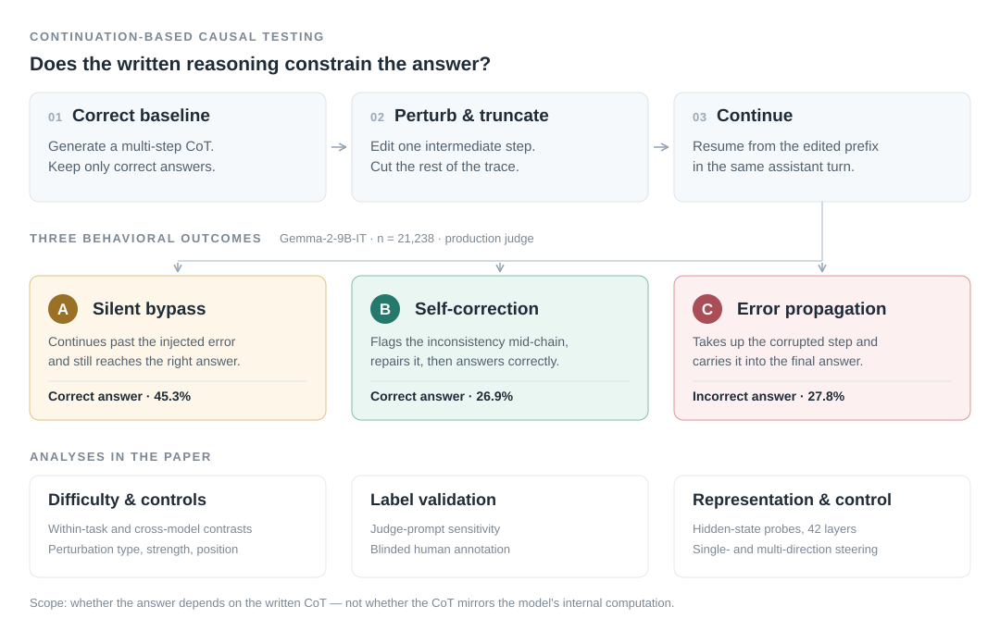
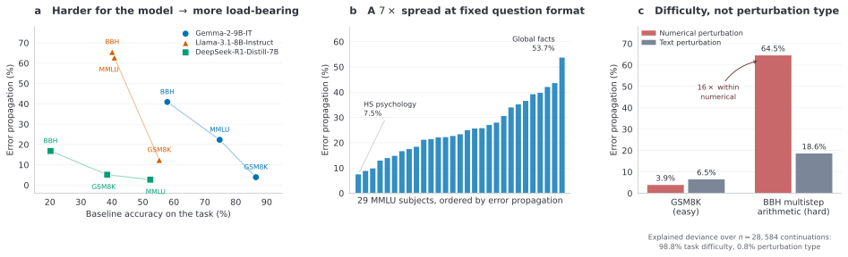

# From Decorative to Load-Bearing

**Task Difficulty Shapes the Causal Role of Chain-of-Thought**

**Renee Jia, Di Mu** · [R2M AI](https://r2m.ai/) · Transactions on Machine Learning Research (TMLR), 2026

[Paper](https://openreview.net/pdf?id=TiZQnKDIHq) · [OpenReview](https://openreview.net/forum?id=TiZQnKDIHq) · [Dataset](https://huggingface.co/datasets/ReneeJia/cot-load-bearingness) · [Findings](#research-findings) · [Run the benchmark](#run-the-benchmark) · [Reproduce the paper](docs/paper-reproduction.md) · [Experiment map](experiments/README.md)

When a language model writes a chain of thought, does that reasoning constrain its answer? The question matters because chain-of-thought is widely proposed as a substrate for monitoring what models are doing — and a monitor that reads the chain is informative only if the chain actually drives the output.

We test this directly. Change one intermediate step, truncate the trace there, and force the model to continue from the corrupted prefix. What it writes next shows whether it bypasses the injected error, catches and repairs it, or carries it into the answer. Across three model families and three benchmarks, the answer depends on difficulty: the written chain is close to decorative on easy tasks and load-bearing on hard ones.

This repository holds the paper's experiments, results and annotation materials, together with the **CoT Load-Bearingness Benchmark** for measuring the same thing on other models.

<p align="center">
  
</p>

**Study overview.** Percentages are the pooled Gemma results under the production judge (n = 21,238). A and B both recover the correct answer and differ only in whether the continuation acknowledges and repairs the injected error, a distinction that is sensitive to the judge prompt; C follows the corrupted step to an incorrect answer and is not. The protocol tests the **CoT → answer** link. It does not establish whether the written trace reflects the model's internal computation.

## Research findings

Gemma-2-9B-IT contributes 21,238 labeled continuations, and matched perturbation controls bring the combined frame to 28,584. Everything below describes the paper's experiments; the [reusable evaluator](#run-the-benchmark) implements a simplified variant of the protocol and does not re-derive these numbers.

<p align="center">
  
</p>

*Values are the paper's reported rates; C rates are cross-checked against the released [variance-analysis snapshot](results/controls/variance_decomposition/results.json). [Plotting code](experiments/figures/plot_readme_findings.py).*

**1 · Written reasoning becomes load-bearing as the task gets harder for the model.** Gemma's error-propagation rate rises from 3.9% on GSM8K to 22.3% on MMLU and 40.9% on BBH as baseline accuracy falls from 86.5% to 57.9%. The cleanest version of the comparison is internal to MMLU, where question format and perturbation strategies are held fixed and propagation still ranges from 7.5% to 53.7% across 29 subjects. Difficulty here is relative to the model's own competence, not a property of the task in the abstract. The cross-dataset gradient additionally reflects perturbation design and residual BBH answer-scoring errors, so we treat the within-MMLU contrast as the primary evidence.

| Model | GSM8K | MMLU | BBH |
|---|---|---|---|
| Gemma-2-9B-IT | 3.9% *(86.5% acc.)* | 22.3% *(74.8%)* | 40.9% *(57.9%)* |
| Llama-3.1-8B-Instruct | 12.4% *(55.3%)* | 62.8% *(40.8%)* | 65.5% *(40.1%)* |
| DeepSeek-R1-Distill-Qwen-7B | 5.1% *(38.5%)* | 2.7% *(52.4%)* | 16.8% *(20.2%)* |

<sub>Error propagation, with baseline accuracy in parentheses. Judge-prompt-invariant by construction. DeepSeek filters to ≥4 post-think steps (n = 1,603), so its cells are not directly comparable to Gemma's n = 21,238; the cross-model ordering is.</sub>

**2 · The gradient survives controls for perturbation type.** Numerical perturbations propagate about 16 times more often on BBH multistep arithmetic than on GSM8K (64.5% vs 3.9%), while text perturbations on GSM8K yield 6.5%. In the paper's sequential regression over all 28,584 continuations, difficulty accounts for 98.8% of explained deviance, perturbation type for 0.8% and their interaction for 0.4%. Those shares are specific to the fitted model and partition, and perturbation type can still matter a great deal within a single task. A perturbation-magnitude sweep rules out a competence-floor reading. [Analysis results](results/controls/variance_decomposition/results.json).

**3 · Cross-model results are not uniform.** Llama-3.1-8B-Instruct reproduces the difficulty gradient at a lower accuracy level. DeepSeek-R1-Distill-Qwen-7B propagates fewer errors under the tested conditions and shows a compressed gradient. Its experiment edits the visible rationale after `</think>` under a step-count filter and does not intervene on the preceding thinking trace. The contrast is consistent with a role for reasoning-specific post-training, but does not isolate its causal effect.

**4 · Predicting the behavior is not the same as controlling it.** With question-grouped five-fold cross-validation, Gemma probes reach 75.3% three-class accuracy and 86.2% error-propagation accuracy on 2,000 examples, measured against the paper's labels. Single-direction additive steering along the same probe direction is a null result across 11,556 generations. An eight-direction intervention moves 24.6% of Type C cases at its strongest setting (14/57; 95% Wilson CI 15.1–37.1%), while most cases stay put and Type B remains underpowered. The conclusion is about the interventions we tested, not about steerability in general.

**5 · Label quality bounds every number above.** In the stratified 500-example study, two annotators agree at κ = 1.00 on C-vs-non-C and κ ≈ 0.93 on the full label scheme. Human consensus matches the paper's production labels on 96.2% of binary decisions but only 76.0% of three-way decisions, because the A/B boundary is prompt-sensitive. C is held fixed across the prompt variants by construction, so that invariance is not independent validation. Refitting the same probes on corrected labels drops three-class accuracy from 99.9% to 75.0% — a caution for any behaviorally labeled probe. [Human-study materials](data/annotations/).

The [paper](paper/main.pdf) gives the full methods, uncertainty estimates and limitations. The [experiment map](experiments/README.md) connects each analysis to its code and released artifacts.

## Run the benchmark

**Measure whether a model's chain-of-thought is causally load-bearing.** Python 3.10+, in an environment supported by vLLM:

```bash
git clone https://github.com/r2m-ai/load-bearing-cot.git
cd load-bearing-cot
python -m venv .venv && source .venv/bin/activate
pip install -r requirements.txt

python evaluate.py --model deepseek-r1-distill-qwen-7b --dataset gsm8k \
  --output-dir runs/deepseek-gsm8k
```

The default run samples 100 questions with a fixed seed, uses greedy decoding, and tests early, middle and late interventions with a 4,096-token budget per generation. Use `--all` for a full dataset run and raise `--max-new-tokens` for longer traces. This entry point makes no external judge API calls.

```bash
python evaluate.py --model gemma-2-9b-it --dataset mmlu

python evaluate.py --model llama-3.1-8b-instruct --dataset bbh \
  --task multistep_arithmetic_two --strategy arithmetic

python evaluate.py --model Qwen/Qwen2.5-7B-Instruct --dataset gsm8k
```

Model aliases, Hugging Face IDs and local model paths are all accepted. A model must support vLLM inference, a chat template, and continuation from an assistant prefix. Accept the model license and authenticate with Hugging Face before loading gated weights. The paper ran on a single NVIDIA H100 80 GB; other models and GPU configurations need appropriate memory and context settings. Run `python evaluate.py --help` for revision pins, local JSONL input and parallelism settings.

**Implementation status.** `load-bearing-v0.1` has offline tests for scoring, continuation setup and output handling; real GPU runs of this new entry point have not yet been validated. Published results for Gemma, Llama and DeepSeek come from the paper pipeline. Qwen is an example of how to supply another model, not a reported result.

## Interpreting a run

The evaluator keeps correctly answered baselines with at least three visible reasoning lines. It edits one line, truncates the response there, and generates both a perturbed continuation and an unedited-prefix control.

**Error propagation rate** is the fraction of parseable perturbed continuations with an incorrect final answer, conditional on baseline correctness, eligibility and the chosen intervention. Low propagation may reflect either bypass or correction; high propagation is not a measure of reasoning quality. The evaluator reports the correctness-based C-vs-non-C proxy without assigning A/B labels — establishing that an error was actually taken up requires inspecting the trace.

Each run produces:

| File | Contents |
|---|---|
| `summary.json` | Propagation rate, paired control error and error-rate difference, baseline accuracy, sample counts, answer coverage; breakdowns by task and position |
| `baselines.jsonl` | Questions, references, prompts, baseline responses and eligibility |
| `interventions.jsonl` | Original and edited steps, both prefixes, continuations, extracted answers and scores |
| `manifest.json` | Protocol version, arguments, model ID, dataset fingerprints, sampled IDs/hash, package versions, chat template and run status |

Unparseable answers stay unscored and undefined rates are `null`. Output directories are never overwritten. When comparing models, report coverage and eligibility alongside the rate, and hold the intervention and parsing settings fixed. The [protocol specification](docs/protocol.md) defines the estimand and how it differs from the paper experiments.

## Repository

| Path | Contents |
|---|---|
| [`evaluate.py`](evaluate.py), [`load_bearing/`](load_bearing/) | Reusable evaluator: model backend, dataset adapters, intervention and scoring |
| [`experiments/`](experiments/) | The paper pipeline and every analysis built on it, grouped by research question ([map](experiments/README.md)) |
| [`results/`](results/) | Released result snapshots, grouped the same way |
| [`data/`](data/) | Example records, small reference artifacts and human-annotation materials |
| [`paper/`](paper/), [`figures/`](figures/) | Manuscript source and PDF, paper figures and table CSVs ([map](figures/README.md)) |
| [`docs/`](docs/) | [Protocol specification](docs/protocol.md) and [paper-reproduction guide](docs/paper-reproduction.md) |
| [`tests/`](tests/) | Offline regression tests (`python -m unittest discover -s tests`) |

The released data artifacts are also published as a Hugging Face dataset, [`ReneeJia/cot-load-bearingness`](https://huggingface.co/datasets/ReneeJia/cot-load-bearingness): labeled continuations, the four-variant judge labels, the human-validation frames and the paper's aggregate tables.

Large generation files, hidden-state arrays, probe checkpoints and returned human-label files are not included. The [reproduction guide](docs/paper-reproduction.md) lists what ships and what has to be regenerated. See [Contributing](CONTRIBUTING.md) for adding models, datasets or results.

## Citation

Please cite the paper when using the protocol or code, and report the protocol version and evaluation settings.

```bibtex
@article{jia2026loadbearing,
  title   = {From Decorative to Load-Bearing: Task Difficulty Shapes the Causal Role of Chain-of-Thought},
  author  = {Renee Jia and Di Mu},
  journal = {Transactions on Machine Learning Research},
  year    = {2026},
  url     = {https://openreview.net/forum?id=TiZQnKDIHq}
}
```

Code: [MIT](LICENSE). Paper text and figures: © the authors. Datasets and model weights retain their respective terms.

Questions and contributions are welcome — Renee Jia, reneejia@r2m.ai · [r2m.ai](https://r2m.ai/)
